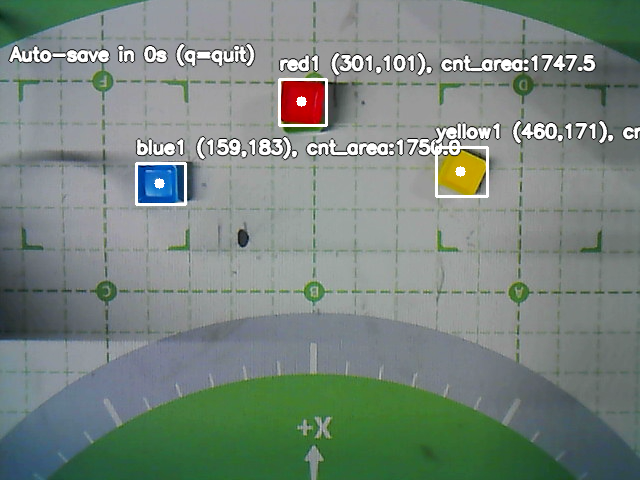

# 🤖 dobot-gemini-pickplace

**LLM-controlled pick-and-place robot system using Dobot Magician Lite, Google Gemini, and OpenCV.**

Natural language commands drive vision-based block detection and robot manipulation — no manual scripting of motion steps required.

---

## 📽️ Demo

| Stack on top | Place beside |
|---|---|
| [Watch on YouTube](https://youtube.com/shorts/j0u11w9H-XY) | [Watch on YouTube](https://youtube.com/shorts/vbGWtz7LmmM) |

---

## 📸 Detection Preview



*HSV-based block detection: each block is labeled with color, ID, and pixel coordinates.*

---

## ✨ Features

- 🗣️ **Natural language control** — type commands like *"put blue1 on top of red1"*
- 👁️ **Vision-based block detection** — HSV color segmentation with OpenCV
- 📐 **Affine coordinate mapping** — 2×3 matrix transforms pixel coordinates to robot space
- 🔧 **LLM tool calling** — Gemini orchestrates the full pipeline via structured function calls
- 🔁 **Two placement modes** — stack on top (`on_top`) or place beside (`beside`) with direction
- 🛡️ **Built-in safety rules** — always homes before/after, never guesses block positions

---

## 🧱 System Architecture

```
User Command (natural language)
        ↓
   Google Gemini (LLM)
        ↓
  Tool Calls (structured)
   ┌────────────────────────────────┐
   │ get_dobot_device               │  Connect to robot
   │ move_to_home                   │  Home arm
   │ capture_scene_with_detection   │  Camera → detect blocks
   │ pick_and_place_block           │  Execute manipulation
   │ move_to_home                   │  Return home
   └────────────────────────────────┘
```

---

## 🗂️ File Structure

```
dobot-gemini-pickplace/
│
├── LLM_ROBOT.py                  # Main controller — Gemini API + conversation loop
├── call_function.py              # Maps LLM tool calls to Python functions
├── config.py                     # Calibration: affine matrix, Z heights, camera settings
├── run_stack_block.py            # CLI shortcut: stack one block on another
├── run_place_beside.py           # CLI shortcut: place block beside another
├── run_understand_scene.py       # CLI shortcut: capture and describe the scene
├── requirements.txt
│
├── Robot_Tools/
│   ├── Robot_Motion_Tools.py     # Low-level Dobot control (move, suction, affine transform)
│   ├── Pick_Place_Tool.py        # High-level pick-and-place logic
│   └── Camera_Capture_Tools.py  # Camera capture + HSV block detection
│
├── Helper_Functions/
│   └── file_handling.py         # File utilities for the LLM (read, write, run scripts)
│
└── captures/
    ├── capture_scene.png         # Annotated camera frame
    └── capture_scene.json        # Detected block labels and pixel coordinates
```

---

## ⚙️ Setup

### 1. Clone the repo
```bash
git clone https://github.com/Niki-89-AI/dobot-gemini-pickplace.git
cd dobot-gemini-pickplace
```

### 2. Install dependencies
```bash
pip install -r requirements.txt
```

### 3. Create a `.env` file
```
GEMINI_API_KEY=your_api_key_here
```
Get your key at [aistudio.google.com](https://aistudio.google.com)

### 4. Update `config.py`
Set your calibrated affine matrix, serial port, and Z heights.

---

## 🚀 How to Run

### Interactive mode
```bash
python LLM_ROBOT.py
```
Then type a command:
```
You: put blue1 on top of red1
You: place green1 to the right of yellow1
```

### Shortcut scripts
```bash
python run_stack_block.py blue1 red1
python run_place_beside.py green1 yellow1 right
python run_understand_scene.py
```

---

## 🛠️ Tech Stack

| Component | Technology |
|---|---|
| Robot | Dobot Magician Lite |
| LLM | Google Gemini 2.5 Flash |
| Vision | OpenCV (HSV detection) |
| Coordinate mapping | NumPy affine transform (2×3) |
| Robot API | pydobot |
| Language | Python 3 |

---

## 📌 Notes

- Ensure proper camera calibration before use — affine matrix accuracy directly affects placement precision
- Lighting conditions affect HSV detection; thresholds may need tuning
- The robot always homes before and after each operation
- If a block is not detected, execution stops safely

---

## 📄 License

MIT License
